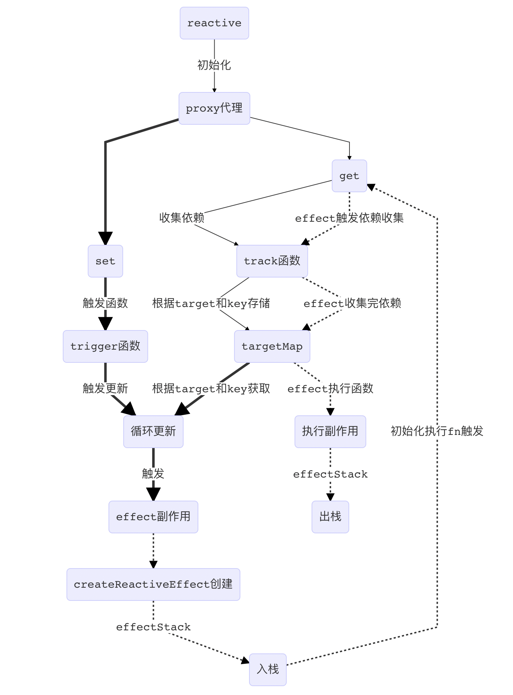

# vue3.0 源码学习-reactive

最近在寻在学习方向，然后就想学习源码，看看能理解多少，算是个尝试，clone 了 vue3 的库，然后结合一些视频和网上的教程，尝试去理解 vue3 的源码思路，于是就拥有了下面这篇学习笔记，vue3.0 源码学习-reactive 篇。

<!-- more -->

## 目标

1. `reactive`初始化数据时发生了什么
2. `effect`副作用是怎么更新的

### `creative`初始化数据

`let data = reactive(obj)`时发生了什么，其实这个网上很多的教程说明了，就是一个用[`proxy`](https://developer.mozilla.org/zh-CN/docs/Web/JavaScript/Reference/Global_Objects/Proxy)代理拦截了`get`和`set`操作，初始化的过程重点是在`get`和`set`中的收集依赖和触发更新机制。

> 结合 vue3 的`reacrive`源码路径`packages/reactivity/src/reactive.ts`去看初始化的代码流程。

#### `get`收集依赖

依赖收集的函数在[`packages/reactivity/src/effect.ts`](https://github.com/vuejs/vue-next/blob/master/packages/reactivity/src/effect.ts)中的`track`函数中实现，具体可点击源码路径链接跳转查看。

其实重点是实现依赖收集的方法，理解它是怎么存储依赖，其存储的数据格式是怎么样的，后期触发`set`的时候如何利用收集的依赖触发更新机制，所以以下是我自己对照一些教程自己敲了一遍简化版本`track`函数的实现：

```js
const targetMap = new WeakMap(); // 依赖存储
let activeEffect = undefined; // 当前执行的副作用
/**
 * 依赖收集
 * @param {object} target - 目标对象
 * @param {string} key - 对象键名
 * 收集的数据格式，重点就是要吧数据整理成下面的格式
 * targetMap<WeakMap>: {
 *   target<Map>: {
 *     key<Set>: [effect,effect...]
 *   }
 * }
 */
function track(target, key) {
  if (activeEffect === undefined) {
    return;
  }
  // 初始化结构
  let depsMap = targetMap.get(target); // 查询
  if (!depsMap) {
    // 如没有就初始化一个Map数据赋值
    targetMap.set(target, (depsMap = new Map()));
  }
  let dep = depsMap.get(key); // 查询
  if (!dep) {
    // 如没有就初始化一个Set数据赋值
    depsMap.set(key, (dep = new Set()));
  }
  // 依赖收集绑定数据
  if (!dep.has(activeEffect)) {
    // 如未收集过的就进行add收集
    dep.add(activeEffect);
  }
}
```

> 当中`activeEffect`是需要关联上副作用`effect`的实现的，后面会整体关联起来总结一遍流程。

#### `set`触发更新

初始化中我们在`get`收集好的依赖（`activeEffect`副作用）在我们`set`的时候回去找到对应的依赖（副作用）触发更新。

> 理解起来就是，我们在更新一些双向绑定的数据的时候，会动态的触发视图的更新，或者一些函数的执行，就像我们一直用的计算属性和侦听器
> `computed`和`watch`，它们就是利用更新副作用原理来实现的。

`set`的更新函数源码是在[`packages/reactivity/src/effect.ts`](https://github.com/vuejs/vue-next/blob/master/packages/reactivity/src/effect.ts)中的`trigger`函数，具体可点击源码路径链接跳转查看

同样的，看源码好像很复杂，然后我也是结合网上的一些教程，自己敲了个简化版的`trigger`来主要看下它怎么获取依赖执行更新

```js
/**
 * 执行更新
 * @param {object} target - 目标对象
 * @param {string} key - 对象键名
 * 触发更新，主要是通过target和key去到依赖收集targetMap里找出对应的副作用effect去执行
 */
function trigger(target, key) {
  /**
   * targetMap的格式，根据target和key一步步的拿到最里面的effect
   * targetMap<WeakMap>: {
   *   target<Map>: {
   *     key<Set>: [effect,effect...]
   *   }
   * }
   */
  const depsMap = targetMap.get(target); // 查询
  if (!depsMap) {
    return;
  }
  const effects = new Set(); // 存储待执行的依赖（副作用）
  let deps = depsMap.get(key); // 查询
  if (deps) {
    deps.forEach((e) => {
      effects.add(e);
    });
  }
  const run = (e) => e(); // run写成一个函数，是后面computed的执行也会用它
  effects.forEach(run); // 触发更新（执行副作用）
}
```

> 最后的`effects.forEach(run) `循环去触发更新是配合上`get`中收集依赖（副作用`effect`），最后会串联一起总结一遍。

最后是串联`get`和`set`的依赖收集和触发更新的副作用`effect`，它的创建函数源码在[`packages/reactivity/src/effect.ts`](https://github.com/vuejs/vue-next/blob/master/packages/reactivity/src/effect.ts)中的`createReactiveEffect`函数，具体可点击源码路径链接跳转查看

以下是简化版的实现

```js
let effectStack = []; // 栈操作
/**
 * 创建副作用
 * @param {function} fn - 函数
 * @param {object} options - 配置
 */
function createReactiveEffect(fn, options) {
  const effect = function reactiveEffect() {
    if (!effectStack.includes(effect)) {
      // 不在栈中
      try {
        effectStack.push(effect); // 入栈
        activeEffect = effect; // 赋值
        return fn();
      } finally {
        // 无论上面是否报错，必执行初始化
        effectStack.pop(); // 出栈
        activeEffect = effectStack[effectStack.length - 1];
      }
    }
  };
  return effect;
}
```

## 总结

整体`get`、`set`和`effect`的关系，这里将在我实现的简化版的代码中整理流程思路。以下是配合流程梳理的简化版`reactive`代码

```js
const reactiveMap = new WeakMap();

function reactive(target) {
  return createReactiveObject(target, false, mutableHandlers, reactiveMap);
}

// 是否是对象
const isObject = (val) => val !== null && typeof val === "object";

// 创建
function createReactiveObject(target, isReadonly, baseHandlers, proxyMap) {
  // 非对象直接返回
  if (!isObject(target)) {
    console.warn("该数据不能使用reactive");
    return target;
  }
  // 相同的代理对象
  // let obj = { msg: '1' }
  // let data = reactive(obj)
  // let m = reactive(obj)
  const existingProxy = proxyMap.get(target);
  if (existingProxy) {
    console.log("相同的代理对象");
    return existingProxy;
  }
  // 创建proxy
  const proxy = new Proxy(target, baseHandlers);
  // 记录已代理（proxy）的数据
  proxyMap.set(target, proxy);
  return proxy;
}

const get = createGetter();
const set = createSetter();

// 创建proxy的代理函数
const mutableHandlers = {
  get,
  set,
};

// get
function createGetter() {
  return function get(target, key, receiver) {
    const res = Reflect.get(target, key, receiver);
    console.log(`获取：${key} - ${target[key]}`);
    // 依赖搜集
    track(target, key);
    // 如果是嵌套的obiect，递归
    if (isObject(res)) {
      return reactive(res);
    }
    return res;
  };
}

// set
function createSetter() {
  return function set(target, key, value, receiver) {
    let oldValue = target[key];
    // 数组会设置length，判断长度一致return
    if (oldValue === value) {
      return true;
    }
    const res = Reflect.set(target, key, value, receiver);
    console.log(`设置：${key} - ${target[key]}`);
    trigger(target, key); // 触发更新
    return res;
  };
}

// 依赖搜集
const targetMap = new WeakMap();
let activeEffect = undefined;
/**
 * 依赖收集
 * @param {object} target - 目标对象
 * @param {string} key - 对象键名
 * 收集的数据格式，重点就是要吧数据整理成下面的格式
 * targetMap<WeakMap>: {
 *   target<Map>: {
 *     key<Set>: [effect,effect...]
 *   }
 * }
 */
function track(target, key) {
  if (activeEffect === undefined) {
    return;
  }
  // 初始化结构
  let depsMap = targetMap.get(target); // 查询
  if (!depsMap) {
    // 如没有就初始化一个Map数据赋值
    targetMap.set(target, (depsMap = new Map()));
  }
  let dep = depsMap.get(key); // 查询
  if (!dep) {
    // 如没有就初始化一个Set数据赋值
    depsMap.set(key, (dep = new Set()));
  }
  // 依赖收集绑定数据
  if (!dep.has(activeEffect)) {
    // 如未收集过的就进行add收集
    dep.add(activeEffect);
  }
}

/**
 * 执行更新
 * @param {object} target - 目标对象
 * @param {string} key - 对象键名
 * 触发更新，主要是通过target和key去到依赖收集targetMap里找出对应的副作用effect去执行
 */
function trigger(target, key) {
  /**
   * targetMap的格式，根据target和key一步步的拿到最里面的effect
   * targetMap<WeakMap>: {
   *   target<Map>: {
   *     key<Set>: [effect,effect...]
   *   }
   * }
   */
  const depsMap = targetMap.get(target); // 查询
  if (!depsMap) {
    return;
  }
  const effects = new Set(); // 存储待执行的依赖（副作用）
  let deps = depsMap.get(key); // 查询
  if (deps) {
    deps.forEach((e) => {
      effects.add(e);
    });
  }
  const run = (e) => e(); // run写成一个函数，是后面computed的执行也会用它
  effects.forEach(run); // 触发更新（执行副作用）
}

/**
 * 副作用
 * @param {function} fn - 函数
 * @param {object} options - 配置
 */
function effect(fn, options) {
  let effect = createReactiveEffect(fn, options);
  effect(); // 现执行一次，其实是有options设置判断是否执行的，如像在wacth的时候可以设置第一次是否执行之类的，这里就先不判断其他的实现了。
}

let effectStack = []; // 栈操作
/**
 * 创建副作用
 * @param {function} fn - 函数
 * @param {object} options - 配置
 */
function createReactiveEffect(fn, options) {
  const effect = function reactiveEffect() {
    if (!effectStack.includes(effect)) {
      // 不在栈中
      try {
        effectStack.push(effect); // 入栈
        activeEffect = effect;
        console.log("入栈并且赋值activeEffect");
        return fn();
      } finally {
        // 无论上面是否报错，必执行初始化
        effectStack.pop(); // 出栈
        activeEffect = effectStack[effectStack.length - 1];
        console.log("出栈并且初始化activeEffect");
      }
    }
  };
  return effect;
}

// 如上的简化版执行下面的测试

let obj = { msg: "1" };
let data = reactive(obj);
effect(() => {
  console.log("触发effect副作用:" + data.msg);
  // data.msg 获取数据，所以触发了get
});
data.msg = 2;

// 将会打印出下面的流程：

// 入栈并且赋值activeEffect      ==》createReactiveEffect中的try
// 获取：msg - 1                ==》createReactiveEffect中的return fn() 触发了get函数，触发依赖的收集
// 触发effect副作用:1            ==》createReactiveEffect中的return fn()执行了
// 出栈并且初始化activeEffect     ==》createReactiveEffect中的finally继续初始化
// 设置：msg - 2                ==》data.msg = 2设置值，触发了更新
// 入栈并且赋值activeEffect      ==》在get收集的依赖里重新触发了收集的依赖（副作用函数）
// 获取：msg - 2                ==》再次触发了get依赖收集新的依赖值
// 触发effect副作用:2            ==》完整触发副作用函数createReactiveEffect中的return fn()执行了
// 出栈并且初始化activeEffect     ==》finally继续初始化
```

下面是自己做的简单流程图


